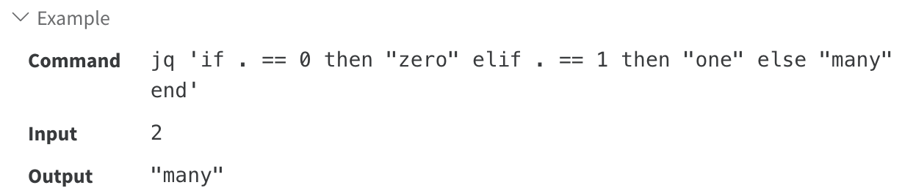

Foundamental concepts

1. Conditionals and Comparisons 
2. if-then-else-end 
3. Alternative operator: // 
4. try-catch 
5. Breaking out of control structures 
6. Regular Expressions 

## Conditionals and Comparsions

Jq provide some logic operator

### == ,!=

### >, >=, <=, < 

### and, or, not

## if-then-else-end 

if A then B else C end will act the same as B if A produces a value other than false or null, but act the same as C otherwise.

if A then B end is the same as if A then B else . end. That is, the else branch is optional, and if absent is the same as .. This also applies to elif with absent ending else branch.

## Alternative operator: //

The // operator produces all the values of its left-hand side that are neither false nor null, or, if the left-hand side produces no values other than false or null, then // produces all the values of its right-hand side.

A filter of the form a // b produces all the results of a that are not false or null. If a produces no results, or no results other than false or null, then a // b produces the results of b.

This is useful for providing defaults: .foo // 1 will evaluate to 1 if there's no .foo element in the input. It's similar to how or is sometimes used in Python (jq's or operator is reserved for strictly Boolean operations).

## try catch 

try EXP catch EXP

## Breaking out of control structures 

A convenient use of try/catch is to break out of control structures like reduce, foreach, while, and so on.

## Regular expressions 

