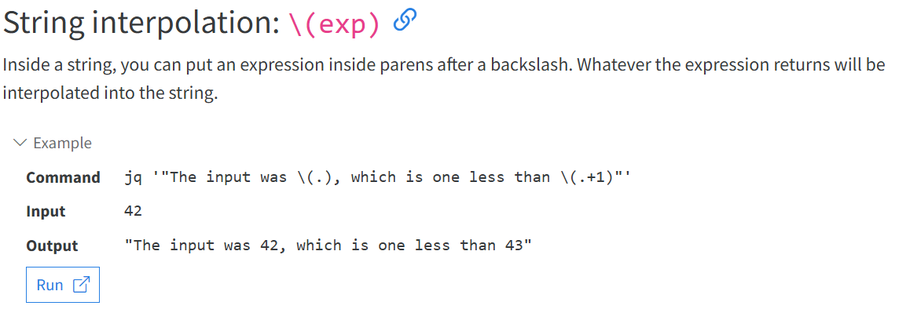
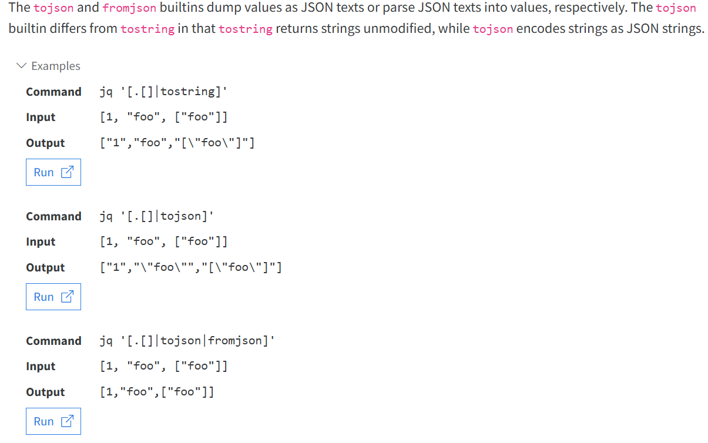
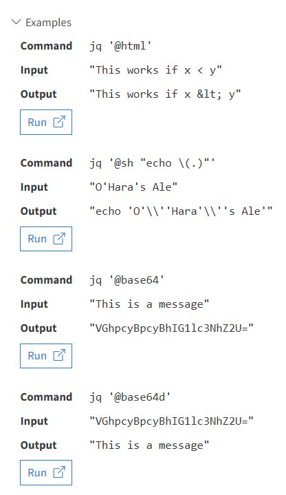
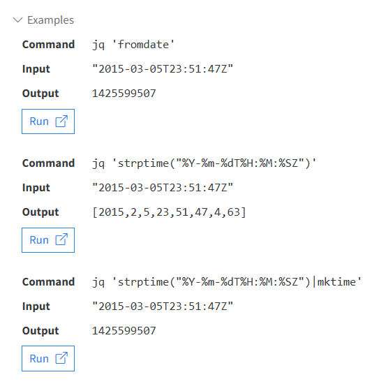

# Intro 

jq supports the same set of datatypes as JSON - numbers, strings, booleans, arrays, objects (which in JSON-speak are hashes with only string keys), and "null".

So that there is some way to construct array and object

Numbers in jq are internally represented by their IEEE754 double precision approximation. Any arithmetic operation with numbers, whether they are literals or results of previous filters, will produce a double precision floating point result.


Foundamental concepts
1. Array construction: []
2. Object Construction: {}
3. Recursive Descent: ..
4. Built in function 
5. Convert to/from JSON 
6. Format strings and escaping
7. Dates


## Array Construction: []
As in JSON, [] is used to construct arrays, as in [1,2,3]. 

The elements of the arrays can be ***any jq expression***, including a pipeline. 

for example:
 [.foo, .bar, .baz]

### Example

Input : {"user":"stedolan", "projects": ["jq", "wikiflow"]}

Process: jq '[.user, .projects[]]'

1. has 1 comma  = 2 stream

2. Stream 1 .user get the json and get root's user key value

3. Stream 2 .project get root's project Key 's value

4. Stream 2 get all element 

5. Wrap 2 stream output to array

Output:

["stedolan", "jq", "wikiflow"]

## Object Construction: {} 
Like JSON, {} is for constructing objects (aka dictionaries or hashes), as in: {"a": 42, "b": 17}.

Key expressions other than constant literals, identifiers, or variable references, need to be parenthesized, e.g., {("a"+"b"):59}.

```
{user: .user, title: .title}
```
for the case above, since it is so common(do not rename key name)

so there's a shortcut syntax for it: {user, title}.

If one of the expressions produces multiple results, multiple dictionaries will be produced. 

If the input's

```
{"user":"stedolan","titles":["JQ Primer", "More JQ"]}
```

process: 

```
{user, title: .titles[]}
```
output:

```
{"user":"stedolan", "title": "JQ Primer"}
{"user":"stedolan", "title": "More JQ"}
```

to avoid multiple dictionary 

chnage process to this 
```
{(.user): .titles}
```

output:

```
{"stedolan": ["JQ Primer", "More JQ"]}
```

## Recursive Descent: <mark>..</mark>

Note that ..a does not work; use .. | .a instead. In the example below we use .. | .a? to find all the values of object keys "a" in any object found "below" ..

### Example

1. Input 
```
	[[{"a":1}]]
```
2. process
```
..|.a?

1. get into 2 layer  -> {"a":`}
2. check .a key exist if yes return value 
```

3. Output 
```
1
```


## Built in function

https://jqlang.github.io/jq/manual/#builtin-operators-and-functions

please check the above

## String interpolation: \(exp) 


## Convert to/from JSON 


## Format strings and escaping


## Date
